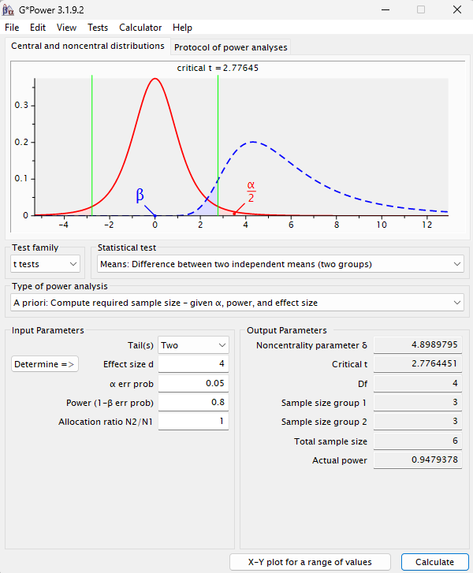
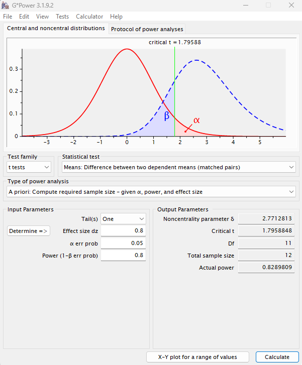
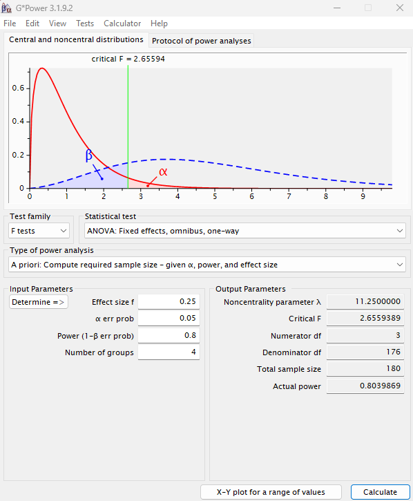
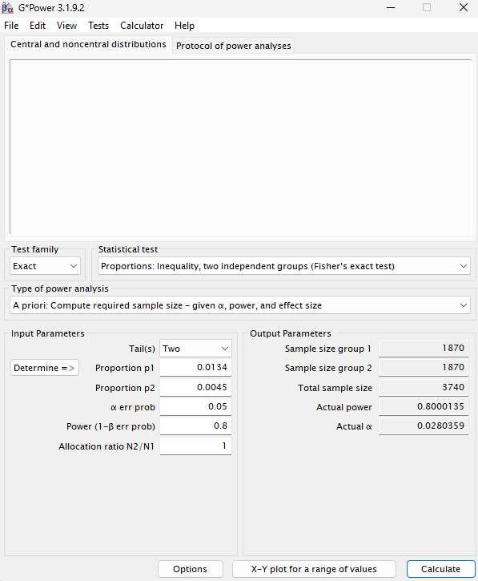

## Poročilo vaja 5.1
#### Velikost vzorcev: test dveh povpračij neodvisnih vzorcev

*Izvedba primerjave očesnega pritiska pri ženskah in moških*
- *Koliko preiskovancev potrebujemo, če hočemo izvesti primerjavo povprečnega očesnega pritiska med moškimi in ženskami pri moči testa 80% in statistični značilnosti 5%?*
  - *Velikost efekta določimo na 4mmHg (iz prejšnjih študij).*
  - *Ravno tako iz prejšnjih študij ugotovimo, da je povprečen normalen očesni pritisk 15.5 $\pm$ 2.5 mmHg.*
  - *Predpostavimo normalnost porazdelitve*
  - *Uporabimo dvostranski t-test*

**Izračun s pomočjo enačbe:**
$N = \frac{4\sigma^2(z_{crit} + z_{pwr})}{D^2} = 12.27$

**Interpretacija:** Dobljeno število zaokrožimo na prvo večje sodo število, 14. To pomeni, da potrebujemo 7 moških in 7 žensk.

**Izračun s programom G*power:**

Če meritve niso normalno porazdeljene, bomo uporabili  Mann-Whitney U test. 

To je neparametrični test, ki ima manj predpostavk in je manj občutljiv, vendar pa je njegova moč manjša, zato potrebujemo več preiskovancev. Število preiskovancev v tem primeru izračunamo tako, da izračunamo velikost vzorca ekvivalentnemu parametričnemu testu (torej dvostranski t-test). Rezultat nato popravimo s korekcijskim faktorjem ARE, ki je v najslabšem primeru enak **0.864.**

$N_{mann-whitney u} = \frac{N_{t-test}}{ARE} = \frac{7}{0.864} = 8.1$

Iz tega sledi, da potrebujemo najmanj **9 moških in 9 ženskih subjektov.**

## Poročilo vaja 5.2
#### Velikost vzorcev: parni testi

- *Z eksperimentom želimo preveriti učinkovitost metode hujšanja*
  - *Eksperiment bomo izvedli tako, da naključno izberemo nekaj ljudi, ki se udeležijo programa hujšanja in jim izmerimo težo na začetku in po koncu programa*
  - *Iz podobnih študij ocenimo, da je standardni odklon razlike (pred in po) približno 2kg*
- *Koliko udeležencev eksperimenta potrebujemo?*

Ker nimamo velikosti efekta, ga določimo sami. Poglejmo kaj se zgodi v treh primerih: ko želimo dokazati majhno (0.2), srednjo (0.5) ali veliko (0.8) velikost efekta. Pričakujemo razliko v eni smeri (merjenci bodo shujšali), zato uporabimo enostranski test.

Če predpostavimo veliko vrednost velikosti efekta, pričakujemo, da bomo zaznali 1.6kg izgube teže:
$d = \frac{\micro_0-\micro_1}{\sigma_s} = \frac{1.6}{2}=0.8$

**Potrebujemo 12 merjencev.**

Če predpostavimo veliko vrednost velikosti efekta, pričakujemo, da bomo zaznali 1kg izgube teže:
$d = \frac{\micro_0-\micro_1}{\sigma_s} = \frac{1}{2}=0.5$

**Potrebujemo 27 merjencev.**

Če predpostavimo veliko vrednost velikosti efekta, pričakujemo, da bomo zaznali 0.4kg izgube teže:
$d = \frac{\micro_0-\micro_1}{\sigma_s} = \frac{4}{2}=0.2$

**Potrebujemo 156 merjencev.**

## Poročilo vaja 5.3
#### Velikost vzorcev: geli s kofeinom

- *Želimo ugotoviti, ali geli s kofeinom vplivajo na izboljšanje rezultatov profesionalnih kolesarjev v vožnji na čas.*
 - *4 skupine kolesarjev (kofein da - vedo, kofein da - ne vedo, kofein ne - vedo, kofein ne - ne vedo)*
 -  *Iz prejšnjih rezultatov ocenjujemo povprečno število prevoženih km na 1h na okoli 50km s std. odklonom 4km.*
 -  *Statistična značilnost = 0.05, moč testa = 0.8* 

Na ravninskih kronometrih razlika v povprečni hitrosti 1km/h lahko pomeni razliko med doseženimi stopničkami ali ne. Določimo velikost efekta za takšno razliko: $f = \frac{\sigma_m}{\sigma} = \frac{1}{4} = 0.25$, kar pomeni srednjo velikost efekta. S pomočjo G*power izračunamo število kolesarjev, ki jih potrebujemo za izvedbo raziskave.

**Potrebujemo 180 kolesarjev, po 45 na skupino.**

## Poročilo vaja 5.4
#### Velikost vzorcev: kontingenčne tabele

- *Ocenjevanje vpliva steroidnih zdravil na vnetje po vstavitvi umetnega kolka.*
  - *Splošno je ugotovljen, da lahko pride do vnetja po zamenjavi kolka v 1% primerov.*
  - *V eni študiji so ugotovili, da pride do vnetja kolka v primeru steroidne injekcije pred opreacijo v 1.34% (3/224), brez injekcije pa je prišlo do vnetja v 0.45% (1/224).*
  - *Ponovili bomo eksperiment, kjer bomo imeli dve skupini pacientov z operacijo kolka, enim bomo dali steroidne injekcije pred operacijo, drugim ne. Preučevali bomo pojav vnetja po vstavitvi umetnega kolka.*
  - *N = ?*

Razlika med deležema $ \Delta p = 1.34\% - 0.45\% = 0.89\%$

Povprečje deleža $\overline{p} = p_1 - p_2$

Za izračun vzorca uporabimo formulo normalne aproksimacije:

$N = \frac{2(Z_{crit}\sqrt{2\overline{p}(1-\overline{p})}z_{pwr}\sqrt{p_1(1-p_1)+p_2(1-p_2)})^2}{\Delta p^2} = 1759$

Na skupino bomo potrebovali 1759 pacientov, skupaj **3518 pacientov.**

Izračunamo še s programom G*power, kjer lahko uporabimo Fisherjev eksakten test.

Izračunamo 1870 pacientov na skupino, skupaj **3740 pacientov.** To razliko lahko pojasnimo z uporabo različnih formul; normalne aproksimacije in Fisherjevega eksaktnega testa.

Če razmišljamo konservativno bomo uporabili večje število pacientov.

